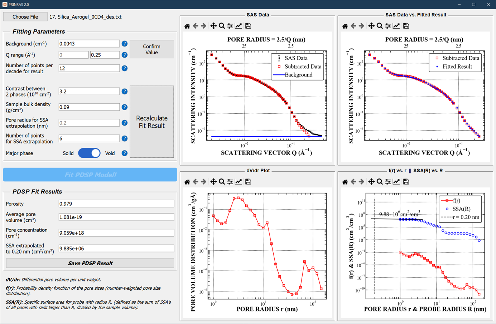

 

## Overview
PRINSAS 2.0 is a GUI-based Python tool for fitting the **Polydisperse Spherical Pore (PDSP) model** to Small Angle Scattering (SAS) data. It extracts pore size distribution, specific surface area (SSA), and porosity from scattering intensity measurements.

 

## Model Basis
PRINSAS 2.0 is based on the **PDSP model**, which describes the differential scattering cross-section of a system composed of polydisperse spherical pores. The model is derived from Debye’s law for two-phase systems and is mathematically represented as:

$$
\frac{d\Sigma}{d\Omega} (Q) = (\rho_1^* - \rho_2^* )^2  \frac{\phi(1-\phi)}{\bar{V}} \int_{R_{min}}^{R_{max}} V_r^2 f(r) F_{sph} (Qr) dr
$$

where:
- $$\frac{d\Sigma}{d\Omega} (Q) $$ is the differential scattering cross-section,  
- $$\rho_1^* $$ and $$\rho_2^* $$ are the scattering length densities of the two phases,  
- $$\phi $$ is the total porosity,  
- $$\bar{V} $$ is the average pore volume,  
- $$V_r $$ is the volume of a pore of radius $$r $$,  
- $$f(r) $$ is the pore size distribution,  
- $$F_{sph}(Qr) $$ is the form factor for a spherical pore.  

## Installation and Execution
### Running the Software
There are two methods to run PRINSAS 2.0:

1. **Using Python (Cross-platform)**:
   - Install Python (version 3.7 or later) and required dependencies.
   - Clone or download this repository.
   - Run the script:
     ```bash
     python run_PRINSAS.py
     ```

2. **Using the Standalone Executable (Windows Only)**:
   - Download the ZIP file from the [GitHub Releases page](https://github.com/henry-pnhvu/PRINSAS-2.0/releases).
   - Extract the ZIP file to a folder on your computer.
   - Locate the `.exe` file inside the extracted folder and run it.  
     **Note:** Windows Defender may require manual approval.

## Data File Input Format
PRINSAS 2.0 supports **ASCII data files** with various delimiters, headers, and footers. The software automatically detects the delimiter but requires a consistent format within each file.  

### Required File Structure:
- The **first two columns** must contain the **scattering vector Q (Å⁻¹)** and **intensity I(Q)**.  
- An **optional third column** can be included for **experimental errors** (defaulting to

### Notes:
- Decimal numbers in **comma format (e.g., 1,234 instead of 1.234)** are **not supported**.  
- The delimiter must be consistent throughout the file.  

  
## Sample Data
Example datasets for testing PRINSAS 2.0 can be found in the [`test data`](https://github.com/henry-pnhvu/PRINSAS-2.0/tree/main/test%20data) directory of this repository. These files demonstrate the various input formats that can be used to verify the software's functionality.  


## User Manual and Technical Background
For detailed instructions on using PRINSAS 2.0, including parameter selection and result interpretation, please refer to the **User Manual** included in this repository.

For detailed information regarding the **mathematical model**, **computational implementation**, and **validation** of PRINSAS 2.0, please refer to the accompanying **manuscript**.

## Contact
For fit discussions, bug reports, or feature requests, please contact **henry@pnhvu.com**.

---
PRINSAS 2.0 is an open-source tool designed to improve accessibility and usability for researchers working with scattering data. Contributions and feedback are welcome!

